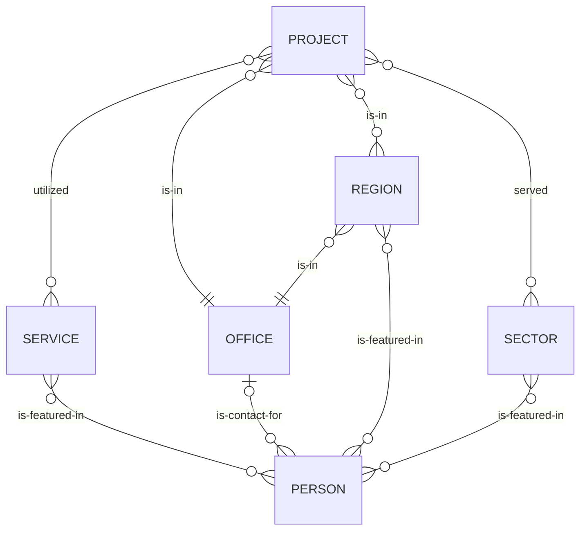

# Site Content Types

## Core Business Content Types

Thought leadership/news content may have optional relationships with any of the above entities.

The `people` relationship is a unique beast; its presence on each different type of content means something slightly different.

- `post` content (the `people` relationship will be treated as a byline)
- `event` content (the `people` relationship will be treated as event attendees)
- `office` content (the `people` relationship will be treated as primary points of contact)
- `sector` content (the `people` relationship will be treated sector leads)
- `service` content (the `people` relationship will be treated as service leads)
- `region` content (the `people` relationship will be treated as key personnel)
- `project` content (the `people` relationship is currently ignored but may be used in the future)
