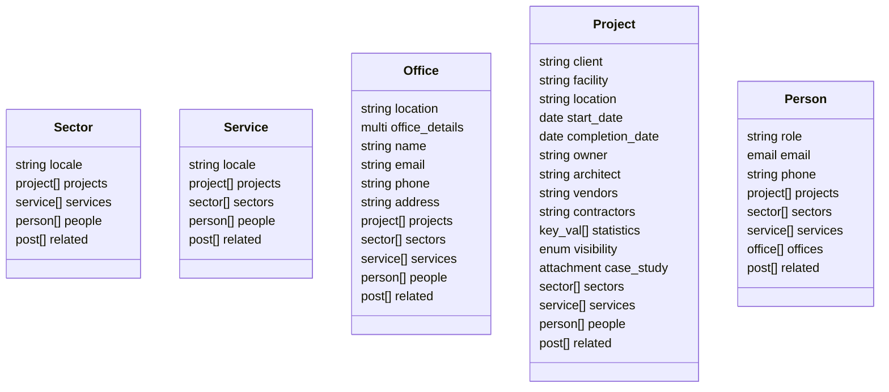
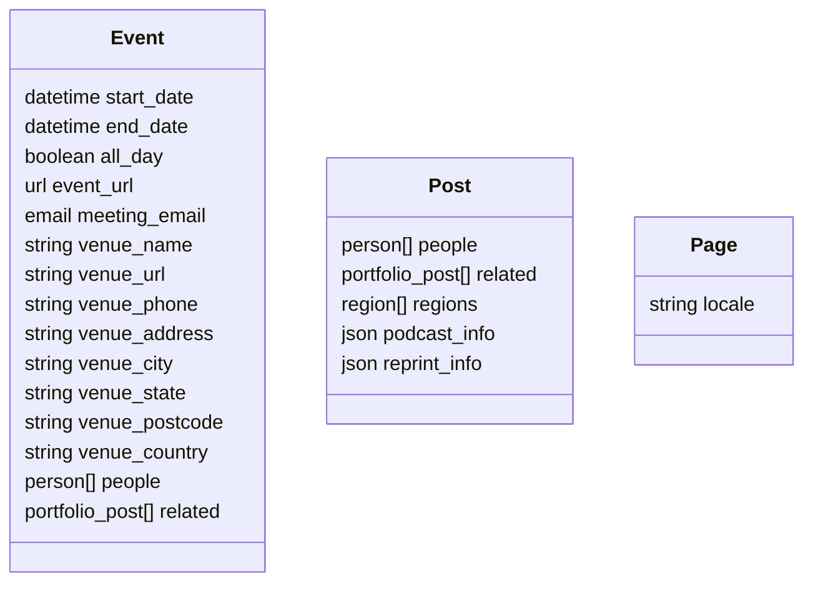
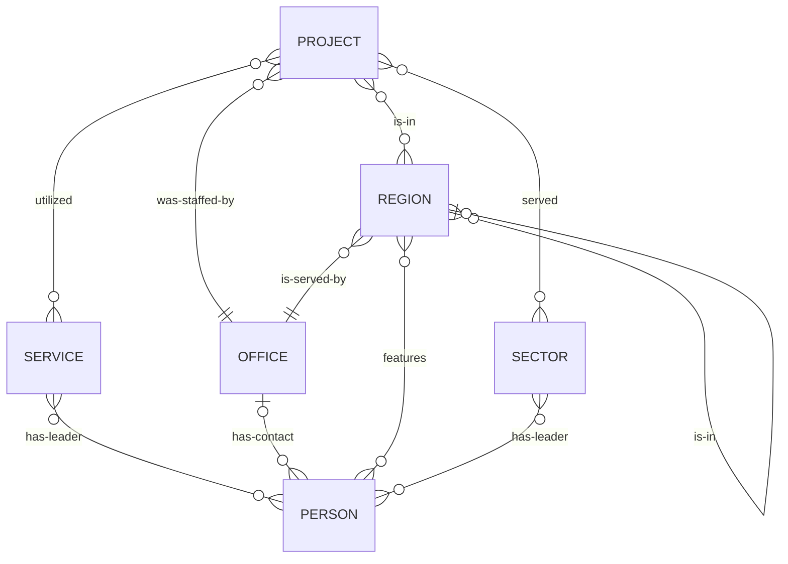

# Site Content Types

## Domain/Portfolio Content Types

## News/Thought Leadership content types

## Relational Overview

The core cluster of business domain post types are used to build the Cumming Group portfolio.

A bidirectional `related` relationship is also used to connect these business domain post types to related news articles, and vice-versa. The core business domain post types may only point to `post`, `event`, and `episode` content in that field, and the news/thought leadership posts may only relate to `project`, `sector`, `service`, `region`, `office`, or `person` posts.

